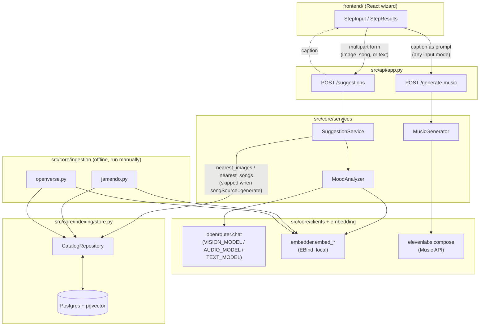

# Architecture

Three layers: a thin HTTP boundary, the services that hold all real logic, and the
clients/storage each service calls through. Nothing outside `src/api` knows about FastAPI,
and nothing outside `src/core/clients`/`src/core/indexing` knows how a given external system
is actually called — that's what lets `MoodAnalyzer` or `SuggestionService` be tested without
a server or a database.

## Why it's split this way

- **`SuggestionService` never calls an external generation API.** It only ever reads from
  the catalog (`CatalogRepository`). Generation lives entirely in `MusicGenerator`, called
  from its own endpoint (`/generate-music`), so a slow or misconfigured ElevenLabs key can
  never block the normal match path.
- **`MoodAnalyzer` dispatches on input mode but produces the same shape** (`caption` +
  `embedding`) regardless of whether the input was an image, an audio file, or text — so
  `SuggestionService` doesn't need to know which mode ran.
- **`songSource` is independent of input mode.** Every input — image, song, or text — comes
  back from `/suggestions` with a caption, and that caption is what `/generate-music` takes
  as its prompt. Uploading an image and picking "Generate with ElevenLabs" works exactly the
  same way text input does; nothing about generation is text-only.
- **Captioning (network) and embedding (local EBind inference) run concurrently**
  (`ThreadPoolExecutor`, one future each) since neither depends on the other's result —
  see `_analyze_image`/`_analyze_audio`/`_analyze_text` in `mood_analyzer.py`.
- **Ingestion is offline and one-directional.** `jamendo.py`/`openverse.py` populate the
  catalog ahead of time; nothing in the request path ever calls them.
