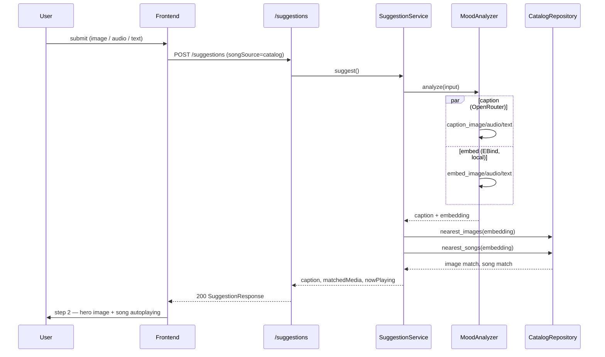
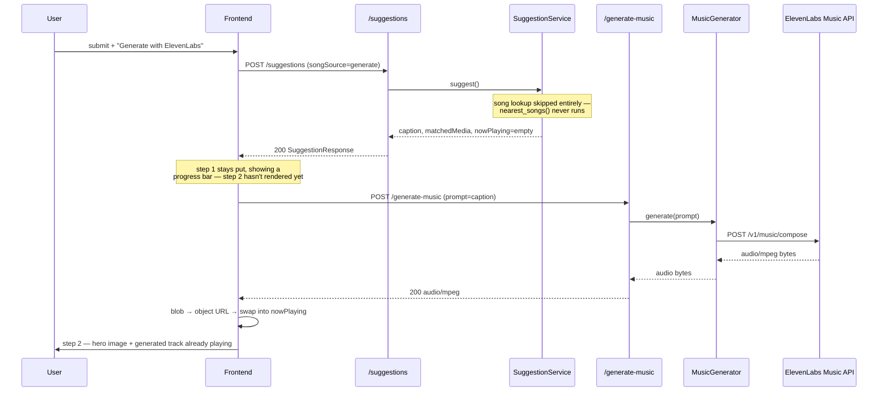

# Sequence diagrams

Two request flows, chosen by the `songSource` toggle in step 1. Both always fetch a matched
photo; only the song differs.

## 1. Catalog match (`songSource=catalog`, the default)

## 2. Generate with ElevenLabs (`songSource=generate`)

